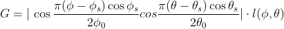
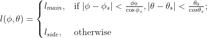

# Тестовое приложение для визуализации диаграммы направленности фазированной антенной решетки

## Возможности
* Расчет диаграммы направленности антенны (в отдельном потоке);
* 3D отображение диаграммы направленности антенны;
* 2D отображение диаграммы направленности антенны (в виде цветовой карты);
* Отображение срезов ДНА по азимуту и возвышению при кликах на цветовую карту.

## Использованные библиотеки
* PyQt5: для общего интерфейса;
* PyQtGraph: для отображения двумерных диаграмм;
* Mayavi: для отображения трехмерной модели ДНА;
* PyTest, pytest-qt: для модульного тестирования интерфейса.

## Алгоритм расчета ДНА
Диаграмма направленности антенны рассчитывается по следующей формуле:

_φ_ - угол по азимуту (из расчётной сетки)

_θ_ - угол по возвышению (из расчётной сетки)

_φs_ - угол установки луча по азимуту

_θs_ - угол установки луча по возвышению

_φ0_ - ширина главного лепестка по азимуту

_θ0_ - ширина главного лепестка по возвышению

_lmain_ - уровень главного лепестка ДНА

_lside_ - уровень бокового лепестка ДНА