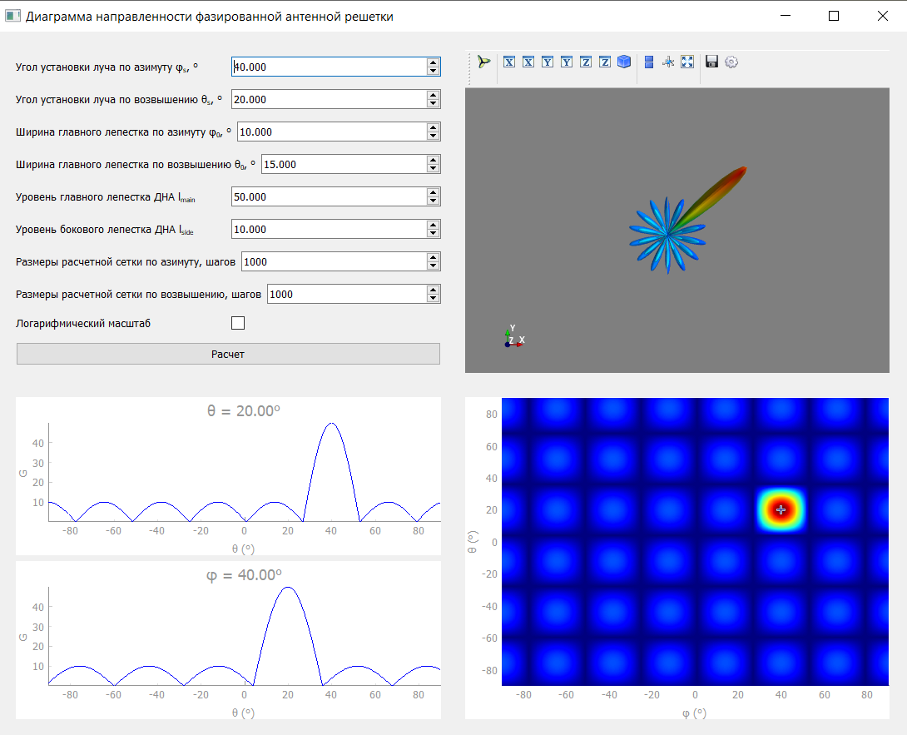

# Тестовое приложение для визуализации диаграммы направленности фазированной антенной решетки

## Возможности
* Расчет диаграммы направленности антенны (в отдельном потоке);
* 3D отображение диаграммы направленности антенны;
* 2D отображение диаграммы направленности антенны (в виде цветовой карты);
* Отображение срезов ДНА по азимуту и возвышению при кликах на цветовую карту.

## Использованные библиотеки
* PyQt5: для общего интерфейса;
* PyQtGraph: для отображения двумерных диаграмм;
* Mayavi: для отображения трехмерной модели ДНА;
* PyTest, pytest-qt: для модульного тестирования интерфейса.

## Установка и запуск
* Требуемые библиотеки находятся в файле requirements.txt;
* python main.py
